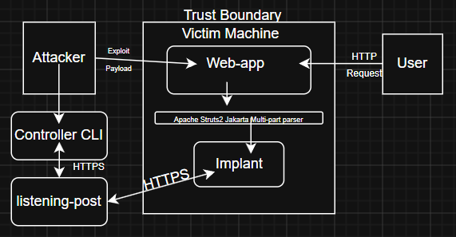

Based on: https://github.com/piesecurity/apache-struts2-CVE-2017-5638


-------

# Milestone 2


## Project Overview: 
* Apache Struts2 Web framework CVE-2017-5638. 
* The vulnerability in the web framework is the Jakarta Multipart parser. If the Content-Type value is not valid, as it does not match an expected value, an exception is thrown that is then used to display an error message to a user. In this case, we can set the Content-Type to an OGNL expression.


## Protocol Summary
Messages are handled as:
1. Length-prefixed data
2. HTTPS (TLS) for beaconing messages sent between implant and listening post
3. Base64 encoding content
4. XOR obfuscation to hide JSON payload structure mitigating against traffic analysis
5. JSON format message payloads


## Attacker: Send HTTP request
   * Injects OGNL(object graph navigation language) expression
   * Executes Shell command that downloads and executes the implant as root as well as establishes the implant's persistence by hooking into the Tomcat startup process
   * Attacker boots the listening post and the operator CLI (optionally in the same command as the implant download and execution)
      * The attacker will send commands from the operator CLI to the listening post, which are queued in a supabase hosted database.
      * Upon receipt of a beacon from the implant, the listening post will forward the task's fetched from the database, encrypting the traffic.
      * The implant will execute the task and send an encrypted result back to the listening post. This can be seen on the results table. This process will also mark the original task on the tasks table as completed, and will update the ‘task_results’ column of the history table.


## Build Instructions:
ENVIRONMENT
   * Clone this repo https://github.com/lltee/struts2-rce (insert our repo name)
   * Run mvn clean package in the project root
   * Run docker built -t hack .
   * Run docker run -d -p 8080:8080 hack
   * Once container is online, it can be verified in browser
      * http://localhost:8080/orders.xhtml
   * Install dependencies in root of repository (struts2-rce):
      * pip install -r requirements.txt
   * Add execution permissions to the loader script
      * chmod +x ./loader.sh
   * Run script in root of repository - example usage:
      * ./loader.sh -b ./Implant/NetSession -p ./persistence.sh -i <TARGET_IP> -l ./listening-post/listening_post.py -c ./controller/controller.py
## Commands


| Command | Description |
|---|---|
| `list-tasks` | View all tasks in the database |
| `list-results` | View results returned by implants |
| `list-history` | View combined task + result history |
| `bundles` | Display available task bundles |
| `addtask <bundle>` | Queue all tasks in a bundle |
| `help` | Show help message |
| `exit` / `quit` | Exit the CLI |


## Task Bundles


| Bundle | Purpose |
|---|---|
| `recon` | Basic system fingerprinting – user, hostname, network, processes, OS |
| `fs` | Filesystem enumeration – SUID binaries, writable directories, text files |
| `persist` | Inspect persistence mechanisms – crontabs, systemd services, `rc.local` |
| `cred` | Credential discovery – env, bash history, SSH keys, sudo, shadow |
| `net` | Network context – ARP, routes, DNS, hosts file, iptables rules |
| `clean` | Anti-forensics – wipe shell history, logs, and `/tmp` |
| `ping` | Lightweight connectivity check to verify implant is alive |


## Usage


```bash
addtask recon
addtask fs
list-tasks
list-results
```


## Architecture / Threat-Model Diagram



  

Further Details:
* Exploit Payload: HTTP Request injected with ONGL code.
* Implant uses OpenSSL’s default cipher list.
* Certificate is embedded and XOR-encrypted and decrypted at runtime.
* The implant uses HTTPS rather than HTTP or TCP to ensure no data is transmitted as plaintext.
