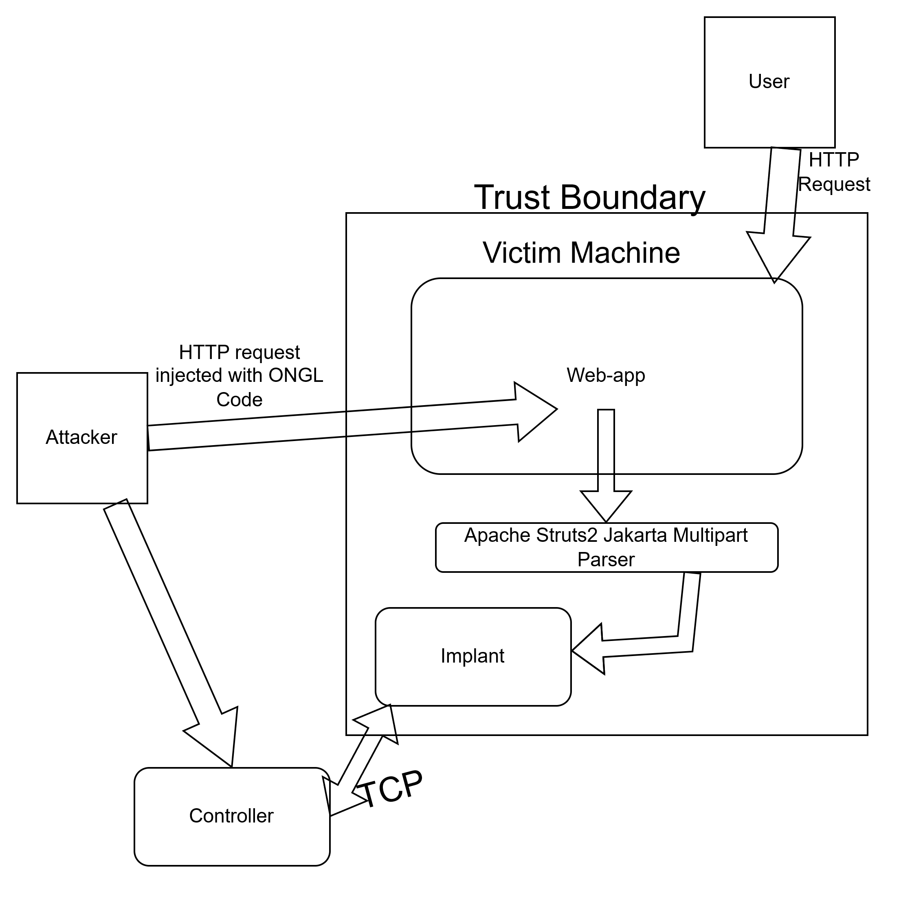

Based on: https://github.com/piesecurity/apache-struts2-CVE-2017-5638

### Usage:
Pre-requisites: have python, docker, maven and a jdk installed

1. clone this repo
1. run mvn clean package in project root
1. run docker build -t hack \.
1. run docker run -d -p 8080:8080 -p 4444:4444 hack
1. once container comes online - verify by running in browser with URL: http://<IP_ADDR>:8080/orders/


README.txt - Rest Showcase Webapp

Rest Showcase is a simple example of REST app build with the REST plugin.

For more on getting started with Struts, see 

* http://cwiki.apache.org/WW/home.html

-------

## Demo

This project also includes a **controlled lab demonstration** of a simple client/server command protocol intended for security research, malware analysis practice, and defensive testing in isolated environments only. 

### Overview

The lab demo consists of two parts:

- **Implant component**: a Python program that listens for TCP connections, receives framed messages, decodes them, and processes supported commands.
  
- **Two-stage loader script**: a shell script that demonstrates staged payload retrieval and execution in a lab workflow.

### Protocol Summary

Messages are handled as:

1. length-prefixed data
2. Base64-encoded content
3. XOR-obfuscated bytes
4. JSON requests after decoding

The service parses incoming requests, dispatches them to handlers, and returns either a normal response or a structured error object. 

### Running C2

```bash
chmod +x ./loader.sh 

./loader.sh [target_ip] ./implant.py 

python3 controller.py [target_ip]
```

### Supported Capabilities

The implant currently defines handlers for:

- `HELLO`
- `SHUTDOWN`
- `SET_SLEEP`
- `READ_DATA`
- `WRITE_DATA`
- `RUN_CMD`

These are implemented through the internal command-handler mapping in the Python service.

### Notes

- The listener is configured to bind on all interfaces on port `4444`. 
- The loader script starts a temporary local HTTP server, triggers retrieval of the implant, then triggers execution as a second stage. 
- This should only be used inside disposable VMs or similarly isolated lab systems.

---

## Architecture Diagram

